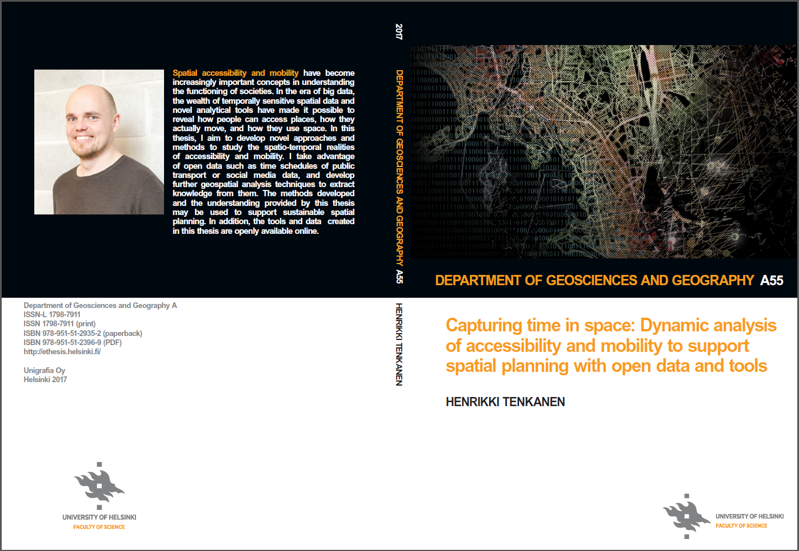

# PhD-thesis
Repository for documenting all the tools, scripts and workflows part of the PhD dissertation: Henrikki Tenkanen (2017) "Capturing time in space - Dynamic analysis of accessibility and mobility to support spatial planning using open data and tools"

_**Missing contents will be added here after the public defense, and once all Chapters have been accepted for publication.**_

### Chapter I

Tenkanen, H., M. Salonen, M. Lattu & T. Toivonen (2015). Seasonal fluctuation of riverine navigation and accessibility in Western Amazonia: An analysis combining a cost-efficient GPS-based observation system and interviews. *Applied Geography* 63, 273-282.

- [Manuscript](http://www.sciencedirect.com/science/article/pii/S014362281500168X)
- Tools / Scripts:
   - [Trajectory reconstruction and analysis tool (TRAT)](https://github.com/AccessibilityRG/TRAT)
 
### Chapter II

Järv, O., H. Tenkanen & T. Toivonen (2017). Enhancing spatial accuracy of mobile phone data using multi-temporal dasymetric interpolation. *International Journal of Geographical Information Science* DOI: 10.1080/13658816.2017.1287369

- [Manuscript](http://www.tandfonline.com/doi/abs/10.1080/13658816.2017.1287369)
- Tools / Scripts:
   - [MDF-interpolation-tool (permalink for citing)](https://doi.org/10.5281/zenodo.252612)
   - [MDF-interpolation-tool (GitHub)](https://github.com/AccessibilityRG/MFD-mobile)
   
### Chapter III

Tenkanen, H., E. Di Minin, V. Heikinheimo, A. Hausmann, M. Herbst, L. Kajala & T. Toivonen (2017). Instagram, Twitter or Flickr: Assessing the usability of social media data for visitor monitoring in protected areas. *Scientific Reports* (minor review).

- Manuscript (added once article is published)
- Tools (added once article is published)

### Chapter IV

Tenkanen, H., P. Saarsalmi, O. Järv, M. Salonen & T. Toivonen (2016). Health research needs more comprehensive accessibility measures: integrating time and transport modes from open data. *International Journal of Health Geographics* 15: 1, 23 p.

- [Manuscript](https://ij-healthgeographics.biomedcentral.com/articles/10.1186/s12942-016-0052-x)
- Tools / Scripts:
   - [MetropAccess-Reititin (public transport routing)](http://blogs.helsinki.fi/accessibility/reititin/)
   - [MetropAccess-Digiroad (private car routing)](http://blogs.helsinki.fi/accessibility/digiroad-tool/)

### Chapter V

Järv, O., H. Tenkanen, M. Salonen, R. Ahas & T. Toivonen (2017). Dynamic cities: Spatial accessibility as a function of time. *Applied Geography* (under review).

- Manuscript (added once article is published)
- Tools (added once article is published)
